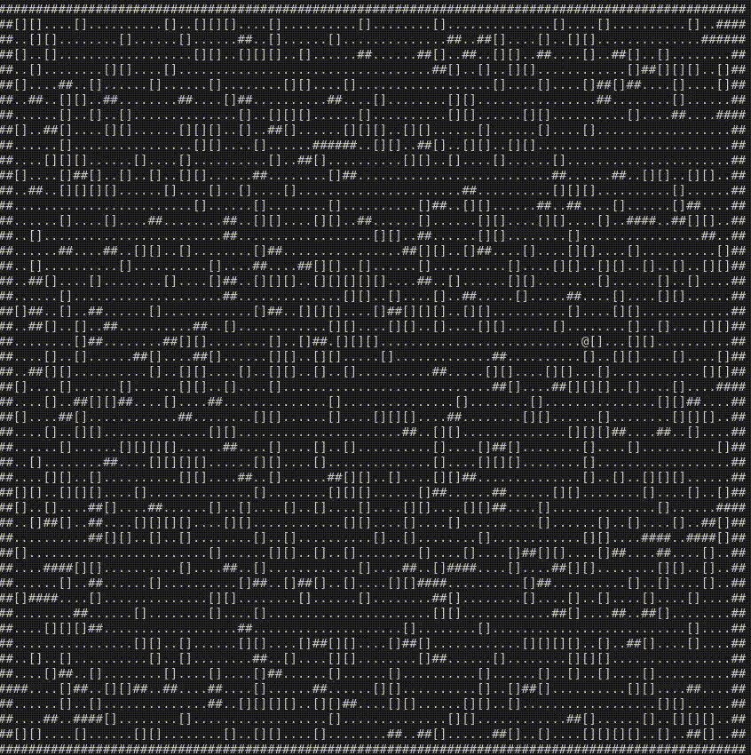

# aoc_2024
[Advent of Code - 2024](https://adventofcode.com/2024)

## Notes
- Suggeestion: Use pen-paper to outline before jumping to code
- Tea and water sips are included in the timings, long breaks excluded
- No other tool is used except the python documentation
    - exception:
    1. day 13: scipy's linalg.solve
- No templates
- First simple solution - could be refactored for improving time and mem efficiency

### Cool animation of robot moving boxes from day15-part2 


```
_______________________
|   Day | Time(HH:MM) |(comments)
|-------+-------------|
|   1   | 00:39       |
|-------+-------------|
|   2   | 00:55       |(part2 couldn't solve)
|-------+-------------|
|   3   | 02:15       |
|-------+-------------|
|   4   | 03:30       |
|-------+-------------|
|   5   | 01:48       |
|-------+-------------|
|   6   | 06:00       |(multidimensional list name referencing, set-reset logic for loop condition, bad execution time)
|-------+-------------|
|   7   | 03:30       |(needed itertools.product function to get arrangements)
|-------+-------------|
|   8   | 02:05       |(the wording is too funny after one solves it otherwise: 'how to write english to confuse')
|-------+-------------|
|   9   | 03:25       |(missed conditions: language bit me; given example not sufficient to get correct algo; use names from problem statement: helps in debugging)
|-------+-------------|
|   10  | 2:55        |(debugging missed conditions; recursion and state of recording variable)
|-------+-------------|
|   11  | 02:20       |(exponential sized array with naive approach; hashing solves: many to one)
|-------+-------------|
|   12  | 06:00       |(bad logic to crawler logic for part1, could not solve part2 on same day: still not an elegant solution)
|-------+-------------|
|   13  | 01:35       |(kind of a cheat: used scipy linalg.solve for solving pair of equations)
|-------+-------------|
|   14  | 01:23       |(part2 meaning of tree picture not understable, even no symmetric shape)
|-------+-------------|
|   15  | 06:20       |(part2 took too long)
|-------+-------------|
|   16  | 00:00       |(could not solve)
|-------+-------------|
|   17  | 03:00       |(part1: one statement misunderstood caused long time; part two: could not solve)
|-------+-------------|
|   18  | full day    |(read about graphs from Skiena, Steven S and solve on next day; then first part was easier and second part also worked is direct approach)
|-------+-------------|
|   19  |             |(didnt attempt due to backlog of day18)
|-------+-------------|
|   20  | 03:25       |(part1: again wrong first approach ends up consuming time until the correct (then obvious) solution is found) 
|       |             |(required change: explore the full plan on paper and reject wrong approaches before iterating in code to save time from wrong approaches)
|-------+-------------|
|   21  | 00:00       |(could not solve)
|-------+-------------|
|   22  | 00:43       |(typo bug took time, could not solve part2)
|-------+-------------|
|   23  | 00:00       |(code that should deal with specific constraints and conditions were missing and adding them took time, could not solve part2)
|-------+-------------|
|   24  | 02:00       |(could not solve part2)
|-------+-------------|
|   25  | 01:30       |(solved without using numpy, could not solve part2 due to missing stars)
|-------+-------------|

```
## Learnings
- TODO: consolidate learnings 